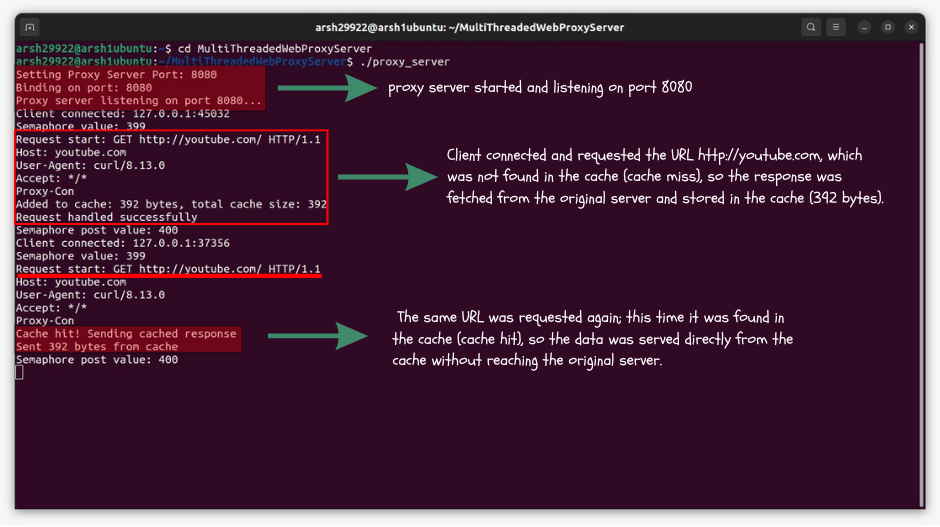
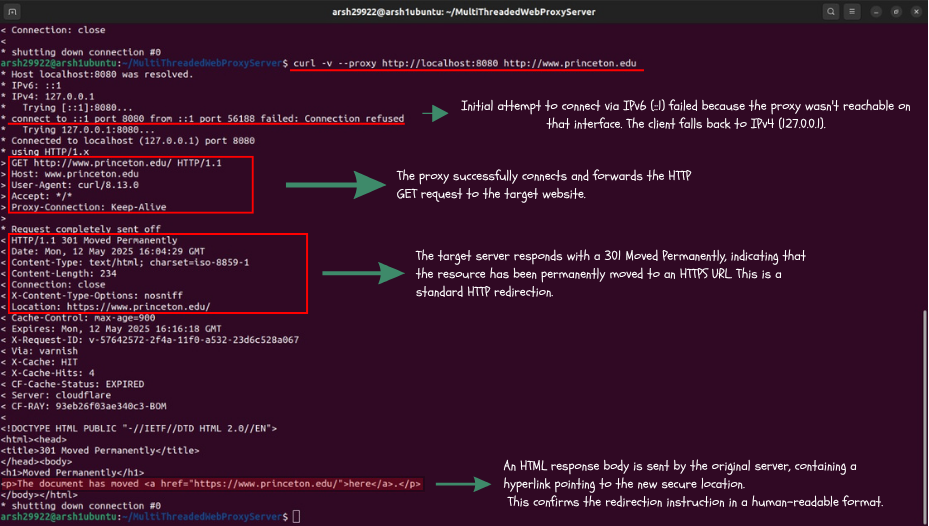
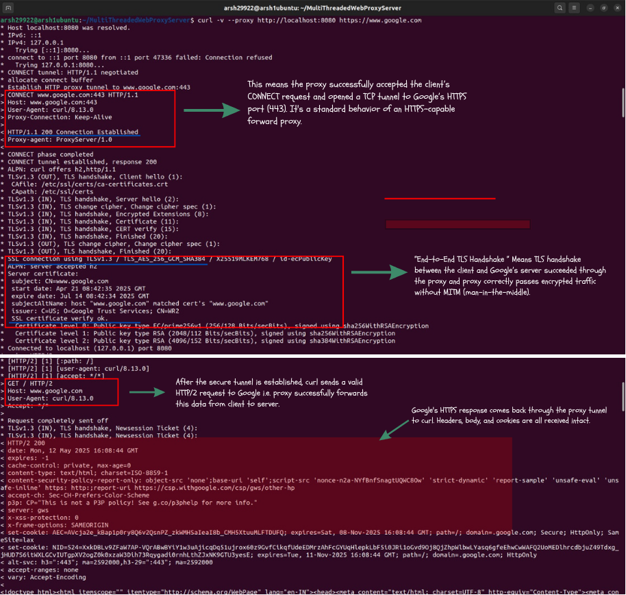
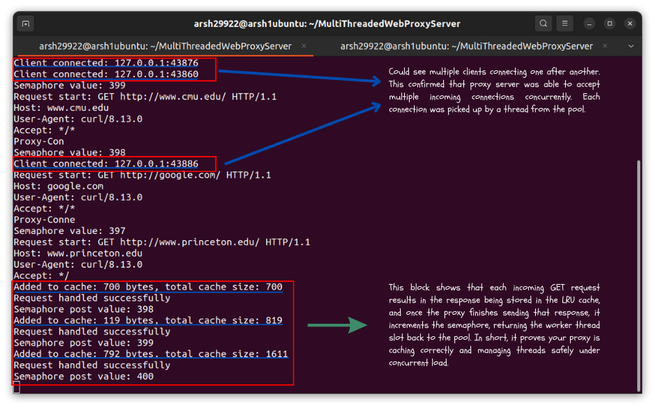
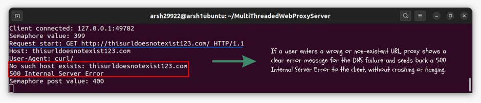

# 🌐 Multithreaded Web Proxy Server Demo 🚀

This document is a live demo of my **Multithreaded HTTP/HTTPS Proxy Server**, showcasing key test scenarios with real commands and annotated outputs.
---

## 📋 Table of Contents

1. [Server Startup & Cache Miss / Cache Hit](#1-server-startup--cache-miss--cache-hit-📦)
2. [HTTPS Tunneling with CONNECT Method](#2-https-tunneling-with-connect-method-🔒)
3. [TLS Handshake Transparency](#3-tls-handshake-transparency-↪️)
4. [Concurrent Requests & LRU Caching](#4-concurrent-requests--lru-caching-📈)
5. [Handling Invalid Domains (DNS Failure)](#5-handling-invalid-domains-dns-failure-❌)

---

## 1️⃣ Server Startup & Cache Miss / Cache Hit 📦

### Command:

```bash
# Start the proxy on port 8080
./proxy_server 8080

# Test cache miss then cache hit
curl -v --proxy http://localhost:8080 http://youtube.com
curl -v --proxy http://localhost:8080 http://youtube.com
```

### Output:



> [View full-size image](pics/proxy_server_1.png)

> **What’s happening?** The first request to `youtube.com` results in a **cache miss** and stores 392 bytes. The second request is a **cache hit**, serving the stored response without contacting the origin.

---

## 2️⃣ HTTPS Tunneling with CONNECT Method 🔒

### Command:

```bash
curl -v --proxy http://localhost:8080 https://www.princeton.edu
```

### Output:



> [View full-size image](pics/proxy_server_2.png)

> **What’s happening?** The proxy establishes a TCP tunnel using the HTTP `CONNECT` method. After `HTTP/1.1 200 Connection Established`, encrypted traffic flows end‑to‑end without inspection.

---

## 3️⃣ TLS Handshake Transparency ↪️

### Command:

```bash
curl -v --proxy http://localhost:8080 https://www.google.com
```

### Output:



> [View full-size image](pics/proxy_server_3.png)

> **What’s happening?** Through the established tunnel, the client and Google perform a full TLS handshake (`TLSv1.3 ... SSL connection using TLSv1.3`). The proxy forwards encrypted data transparently, proving no MITM.

---

## 4️⃣ Concurrent Requests & LRU Caching 📈

### Command:

```bash
curl -s --proxy http://localhost:8080 http://google.com &
curl -s --proxy http://localhost:8080 http://www.princeton.edu &
curl -s --proxy http://localhost:8080 http://www.cmu.edu
```

### Output:



> [View full-size image](pics/proxy_server_5.png)

> **What’s happening?** Multiple background `curl` processes hit the proxy at once. The **semaphore** tracks active threads (399 → 397), and each new response is added to the **LRU cache** (sizes 700 → 819 → 1611 bytes). After each request, the semaphore posts back (398 → 400), ensuring thread slots are recycled.

---

## 5️⃣ Handling Invalid Domains (DNS Failure) ❌

### Command:

```bash
curl -v --proxy http://localhost:8080 http://thisurldoesnotexist123.com
```

### Output:



> [View full-size image](pics/proxy_server_4.png)

> **What’s happening?** The proxy attempts DNS resolution, fails (`No such host exists`), and gracefully returns a `500 Internal Server Error`. The thread releases its semaphore slot afterward, keeping the server stable.

---

> **Project Root:** `PS C:\Users\Mohd Arsh\MultiThreadedWebProxyServer`

*Thank you for exploring this demo! Feel free to clone the repo and try these commands yourself.* 🎉
